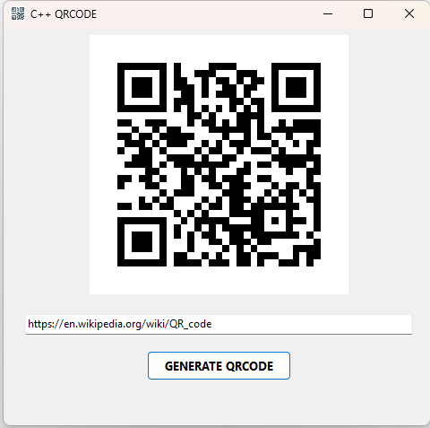

# **CPPASM QR Code Generator**

## **Overview**

The **CPPASM QR Code Generator** is an application developed using Embarcadero C++ Builder and Python. It showcases how to integrate Python scripts into a C++ Builder project to perform tasks that would be more complex to implement directly in C++. This application allows users to generate QR codes from any text input and automatically handles Python library dependencies.

## **Features**

- **QR Code Generation**: Generate QR codes from any text, including links, numbers, and plain text.
- **Automatic Library Installation**: The application automatically installs required Python libraries from a `requirements.txt` file when the form opens.
- **Dynamic Image Loading**: The generated QR code is loaded and displayed within the application interface.
- **File Management**: Automatically deletes the generated QR code file when the application is closed.

## **How It Works**

### **1. Python Script for QR Code Generation**

The core functionality is handled by a Python script that generates QR codes in PNG format. This script is executed by the C++ application, which then processes and displays the output file.

### **2. C++ Application Integration**

The C++ Builder application interacts with the Python script to provide a graphical user interface where users can input text, generate a QR code, and view the result.

### **3. Automatic Library Installation**

On startup, the application runs a Python script to install necessary libraries from the `requirements.txt` file. This ensures all Python dependencies are installed without requiring manual installation.

### **4. Project Setup**

1. **Install Python**: Ensure Python is installed and added to the system PATH.
2. **Create `requirements.txt`**: List the required Python libraries, such as `qrcode` and `pillow`.
3. **Place Scripts**: Ensure `gqrcode.py`, `install_requirements.py`, and `requirements.txt` are in the same directory as your C++ application executable.
4. **Compile the Application**: Use C++ Builder to compile the project.

## **Troubleshooting**

- **Python Not Found**: Ensure Python is installed and properly configured in the system PATH.
- **Script Errors**: Verify the Python script for errors and ensure all required libraries are installed.
- **File Issues**: Ensure the application has necessary permissions to create and delete files.

## **License**

This project is licensed under the [MIT License](LICENSE).

## **Acknowledgements**

- **Python**: For its simplicity and extensive library support.
- **C++ Builder**: For enabling powerful integration of Python and C++.

## **Contact**

For questions or contributions, please contact [Víctor Duarte Melo](mailto:victormeloasm@gmail.com).

